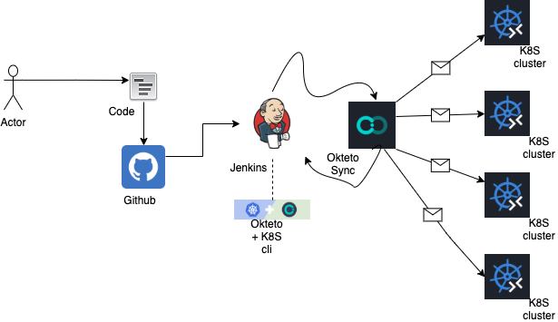

# **okteto-jenkins**
This repo will help one to understand the CICD flow for implementing on fly testing of the kube mainfest using Jenkins on Okteto

## Overview
Kuberenetes made it easy for everyone to easily deploy their application to any scale on any sort of platform. Eventho, the deployment and management of those items made easy. The pain of development process and testing those mainfest would be still a nightmare for many. It is because of the complexity in setting for an Infrastructure just development and so on.

This can be easily removed with the help of Okteto. **Okteto** accelerates the development workflow of *Kubernetes* applications. One can write their code locally and **Okteto** detects the changes as soon as the code is pushed and instantly updates your kubernetes applications.

With *Okteto* in place you can easily address many of such scenarios. In this repo I have covered **Four** *Different* Scenarios also added a video demo for better understanding.

:sparkles: :rocket: :sparkles: I personal enjoyed working on this tool when I was preparing this article, and so I would highly recommend everyone to give it a try atleast once. :sparkles: :rocket: :sparkles:

## Key Components:

#### Kubernetes

Kubernetes is an open-source system to automate the deployment, scaling, and management of containerized applications. This container management system’s popularity soared with the rise of businesses operating on cloud infrastructure and technology

#### Okteto

Okteto Cloud gives you free access to secure Kubernetes namespaces, fully integrated with remote development capabilities. Develop your Kubernetes applications in Okteto Cloud and forget about slow and tedious local development forever.

#### Jenkins

Jenkins gives you flexibilty to build and release the application and infra. Nwadays Jenkins is the core for many projects that needed end to end automated application deployments. In short, it is being used as an orchestrator for deploying applications, Testing the application and infrastructure, provisioning infrastructure and many more.

## Tool Stacks

* Okteto
* Kubectl
* Jenkins
* jenkinsfile
* Nginx
* Httpd
* html

## Getting Started

### Prerequisties

* git is installed
* docker hub repo
* java is installed
* jenkins setup installed and up and running with necessary plugins 
* kubectl installed
* Okteto cli installed and account is created and PAT is generated

` To stick to the scope the above installation pre-requisties are not covered as part of this repo. In case of any help needed, pls feel free to poke me `

## Time to Start

Before we get into the explaintaion lets see the highly level Architecture diagram which will helps us to understand the scenario in much better way.



Okteto helps us to boost our development. In this example I have created a simple sample *Dockerfile* which will create a **httpd** image with an index.html page. *Okteto* allows you to develop inside a container. Also give the flexibility to native use ` okteto cli ` in the same way like one will use Docker cmds.

For examples:

A simple Okteto build cmd which is similar to docker build will do build and push to the respective registry. In my case, I have created **DockerHub** as my container registry.

```
okteto build --tag ${CONTAINER_IMAGE}:${BUILD_TAG} --file dockerfile
```

Added all its supporting optional attributes are very similar to docker commands. So it wont be big deal for anyone to start on the go :+1:

### Advantage:

* Fast inner loop development
* Environment friendly
* Free usage with limitations, can be extented
* Replicability
* Outbox of integration functions with key tools like Helm, Github etc.,.

# Follow-Me

[LinkedIn](https://www.linkedin.com/in/premkumarpalanichamy/)


~~Reference~~
- https://okteto.com/docs/cloud#:~:text=okteto%20cloud%20gives%20you%20free%20access%20to%20secure%20kubernetes%20namespaces%2C%20fully%20integrated%20with%20remote%20development%20capabilities.%20develop%20your%20kubernetes%20applications%20in%20okteto%20cloud%20and%20forget%20about%20slow%20and%20tedious%20local%20development%20forever.
- 